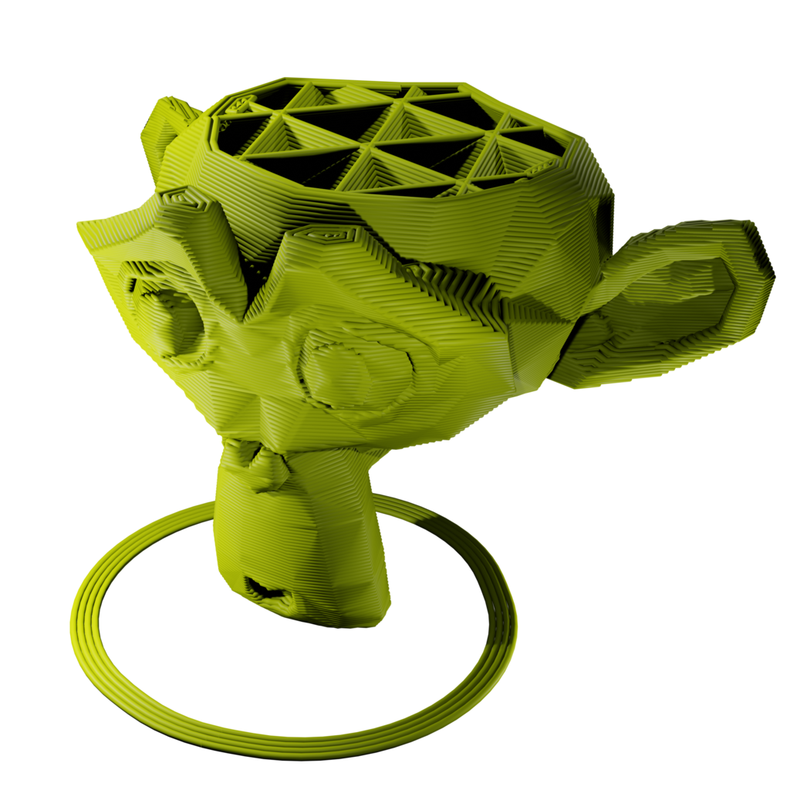
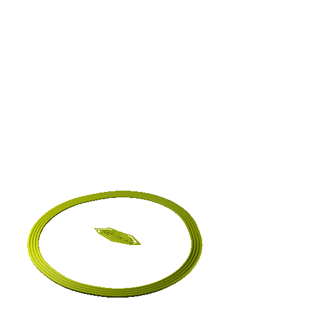

# import-G-code

Imports G-code files into Blender 2.80+ as a collection of layers which can then be animated or exported.

## Installations
*   Download the latest release as a '.zip' file and head over to Blender 4.20+.  
*   ~~Go to Edit->Preferences->Add-on->Install and point to the downloaded '.zip' file.~~

*   **Drag and drop the downloaded '.zip' file to Blender interface.**
*   Make sure that the installed add-on is enabled. 
*   Once enabled, the add-on looks for Regex and Tqdm modules, it prompts for an installation if the required modules are missing. Kindly install them either via the prompt or manually.

## Usage
**Caution: It is a computationally expensive process.**
~~Tested with Cura 4.6.2 and Blender 2.83.~~

**Tested by Nanosize, with Cura version 5.8.1 and Blender version 4.20.**

*   Run Blender 4.20+.
*   Specify **Layer height** and **Nozzle diameter** during file import.

## References
*   [Cura](https://ultimaker.com/software/ultimaker-cura)
*   [G-code](https://reprap.org/wiki/G-code)
